## Vehicle Detection and Tracking

Identify vehicles in a video from a front-facing camera on a car and highlight and track it while it visible.

**Note: This task is designed to demonstrate using of mathematical classifiers like SVM, but NOT deep leaning.**

---

**Vehicle Detection Project**

The goals / steps of this project are the following:

* Perform a Histogram of Oriented Gradients (HOG) feature extraction on a labeled training set of images and train a classifier Linear SVM classifier
* Optionally, you can also apply a color transform and append binned color features, as well as histograms of color, to your HOG feature vector.
* Note: for those first two steps don't forget to normalize your features and randomize a selection for training and testing.
* Implement a sliding-window technique and use your trained classifier to search for vehicles in images.
* Run your pipeline on a video stream (start with the test_video.mp4 and later implement on full project_video.mp4) and create a heat map of recurring detections frame by frame to reject outliers and follow detected vehicles.
* Estimate a bounding box for vehicles detected.

Here I will consider the [rubric points](https://review.udacity.com/#!/rubrics/513/view) individually and describe how I addressed each point in my implementation.  

---
### Writeup / README

#### 1. Provide a Writeup / README that includes all the rubric points and how you addressed each one

You're reading it! and here is a link to my [Vehicle Detection and Tracking project](https://github.com/mcounter/VehicleDetection).

### Histogram of Oriented Gradients (HOG)

#### 1. Explain how (and identify where in your code) you extracted HOG features from the training images

In my code HOG feature vector is base set of parameters used for object detection. I based my code on `skimage` Python library. But to achieve optimal performance and code reusability, it implementation is a bit more complex than just function call. All code for image processing and feature extraction was put in `ImageEngine` class. Next methods are responsible for HOG feature extraction:
* `calcHOGFeatures` - call `skimage.feature.hog()` method with set of parameters. Most important parameters are **orientations** - number of gradient orientations, **pixels_per_cell** - number of pixels per HOG cell, **cells_per_block** - number of cells per normalization block. Also I tried different block normalization functions and SQRT transformation. Function returns HOG matrix (not feature vector) and optionally image for visualization purpose.
* `getImageFeatures` - base method used to calculate set of features for whole image. The same method is used for classifier training purpose and for vehicle detection. It implements calculation of different features, window sliding algorithm and returns non-classified set of features for each window. For HOG purpose it calculates HOG matrix for whole image and extracts sub-features for each window later. For training purpose image size is equal window size.

To extract HOG features, image is initially transformed in **YUV** color space created from slightly adjusted BGR color space (see `ImageEngine.getImageFeatures()` method).

Other HOG parameters I used:

| Parameter | Value |
|:---------:|:-----:|
| orientations | 15 |
| pixels_per_cell | (8, 8) |
| cells_per_block | (2, 2) |
| block_norm | L2-Hys |
| transform_sqrt | True |

I'll demonstrate HOG feature extraction on example of next vehicle and non-vehicle images:

| Vehicle | Non-vehicle |
|:---------:|:-----:|
| 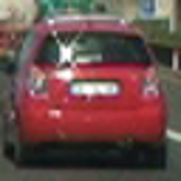 | 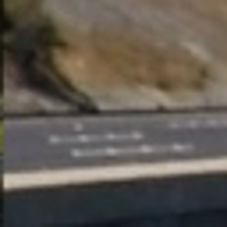 |

After conversion in YUV and HOG features extracted for each channel separately:
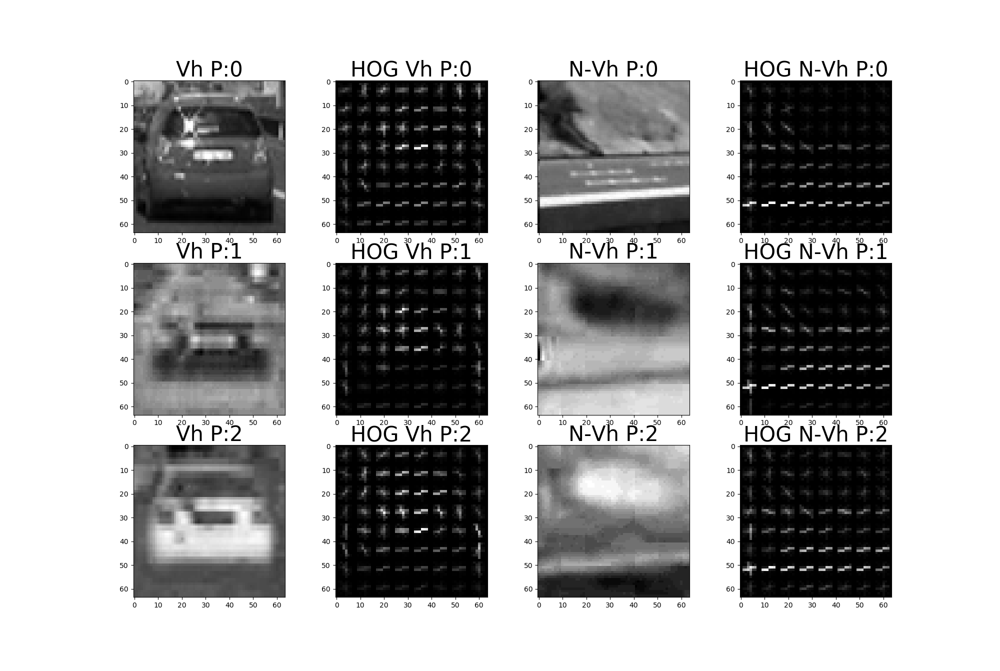

#### 2. Explain how you settled on your final choice of HOG parameters

HOG parameters and in general all parameters for all features was selected empirically based on set of test images extracted from video. Special heat map (see later) was used to evaluate classifier response and number of false positives.

After that set of parameters was tested on whole video and process. New images was added to testing set and process was repeated. I used not only project video, but challenge video from Advanced Lane Finding project.

#### 3. Describe how you trained a classifier using your selected HOG features

Classifier training was implemented in Python executable module `CreateClassifier.py`. It works in next steps:
1. Create set of training data with help of `DeepDataEngine` class. This class calls `ImageEngine.getImageFeatures()` method to extract feature vector for each image, combine it with label and save on disk for future use. It additionally can group images by similarity (based on feature vector) and form training and test sets.
2. Train classifier with help of `ImageClassifier.fit()` function. `ImageClassifier` is wrapper for different classifiers from Python `sklearn` module. It allow not only train classifier but automatically save results on disk and reuse it later in main pipeline. For sake of performance I trained 2 classifiers: `LinearSVC` - fast, but not accurate; `SVC` with `RBF` kernel - more accurate and more slow. Combination of both allow get better performance and accuracy.
3. Evaluate classifier accuracy with help of `ImageClassifier.score()` method. The same - it's wrapper for different `sklearn` classifiers.

After that classifier can be used to predict whether image is vehicle or not. `ImageClassifier.predict()` wrapper is used for this purpose.

Note, that before using of classifier for training, evaluation or prediction, inbound data set is normalized and scaled with help of `sklearn.preprocessing.StandardScaler()` class. First it trained on the same data set as appropriate classifier with help of `sklearn.preprocessing.StandardScaler().fit()` method. After that `sklearn.preprocessing.StandardScaler().transform()` method is used to transform data before using classifier for any purpose.

Because training set is not too big and because classifier parameters don't depend on training data, I did training in 2 steps:
1. Train different classifiers with different parameters (for SVC with different kernels as well) and evaluate performance on separate testing set not used in training process.
2. When optimal classifiers and optimal parameters was found, train it on whole data set to get better accuracy.

Final choice:

| Classifier name | Parameters |
|:---------------:|:----------:|
| LinearSVC | C = 0.01 |
| SVC | kernel = 'rbf', C = 100, gamma = 'auto' |

To train classifier I combined next feature vectors:
* HOG feature vector for Y and V planes of YUV color space. Parameters was already described.
* Spatial color feature with size 32x32. I used OpenCV `cv2.resize()` function and transformation to flatten array with help of Python `ravel()` function for each color plane of YUV color space.
* Color histogram feature with 64 bins. I used Python NumPy `np.histogram()` function to extract this feature vector for each color plane of YUV color space.

### Sliding Window Search

#### 1. Describe how you implemented a sliding window search

Main detection pipeline is implemented in `FrameProcessor` class, method `processFrame()`. It works in next way:
1. Extract features for different sliding window sizes. I used 48, 64, 96, 128 and 192 pixels size square windows with different percentage of overlap. Percentage of overlap was selected to have stride multiple to 16 pixels. For 48, 64, 96 window sizes stride is 16 pixels, for 128, 192 - stride is 32 pixels. It guarantees same window density for each image part. To improve performance and decrease number of false negatives I analyzed only bottom half of image (without fixed stripe of car front bumper). For small window sizes like 48 and 64 only central part of image was used. It's because perspective distortion - small objects appear near to horizon. To extract features for each windows size `ImageEngine.getImageFeatures()` function was used.
2. Run `LinearSVC` classifier to roughly detect vehicles for each feature for each sliding window. This algorithm gives much false positives, but process much faster than `SVC` with `RFB` kernel.
3. For vehicles detected on previous step, confirm it with help of `SVC` classifier with `RBF` kernel.
4. Detect whole objects with help of heat maps and other algorithms (will be described next in appropriate section).

Example of image with sliding windows:

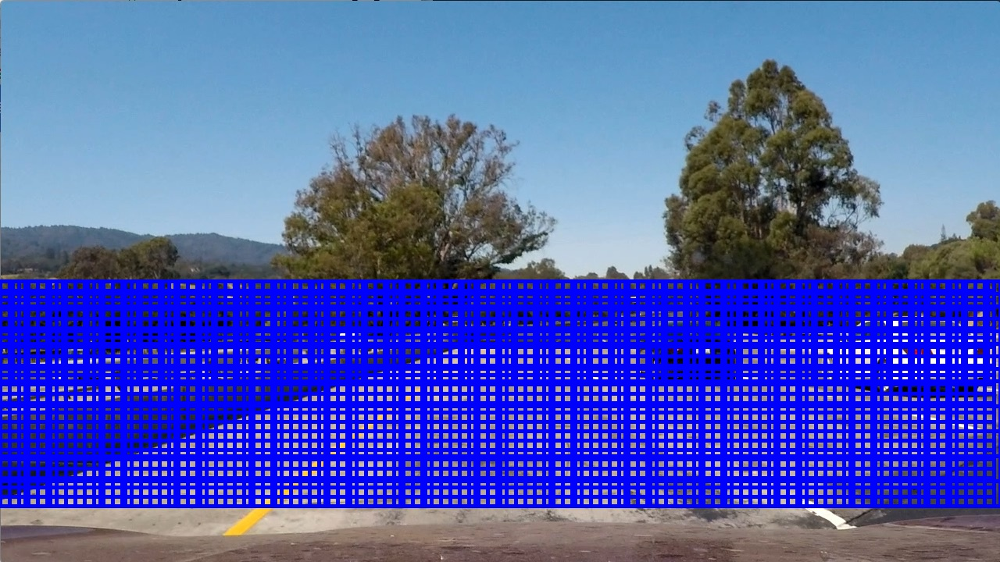

**Note: I tried approach with selective search segmentation, but available OpenCV implementation `cv2.ximgproc.segmentation.createSelectiveSearchSegmentation()` produces very huge number of odd segments, so it hardly applicable to this vehicle detection problem.**

#### 2. Show some examples of test images to demonstrate how your pipeline is working.  What did you do to optimize the performance of your classifier?

As was already described, my pipeline is based on complex feature vector, which includes HOG features, spatial color features and color histogram features. After that with help of sliding window and two classifiers regions with vehicle was detected. Next examples shows result of this process:

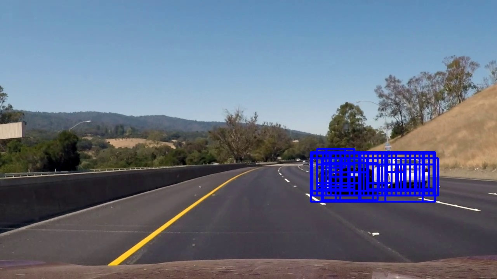

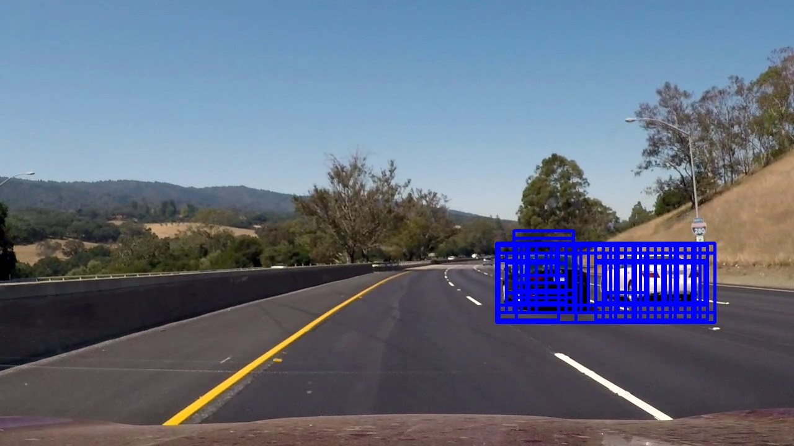

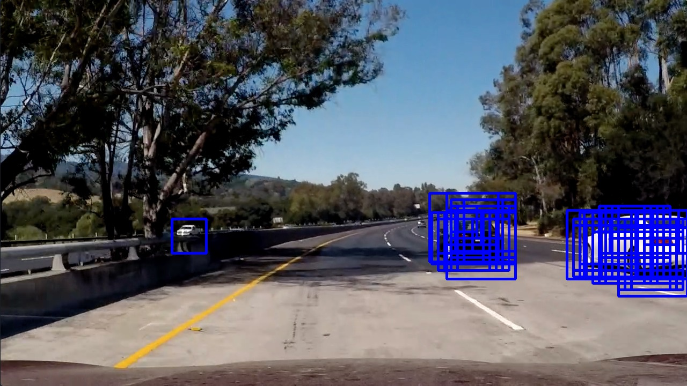

Sliding window approach is too time and resources consumable. To improve performance was done next steps:
* Just bottom half (approximately) of image was analyzed, because part of images above horizon is not interesting, in most cases even close objects don't occupy this part of image. By same reason, small sliding windows (size 48 and 64) was used for middle image part only.
* Two classifiers was used - less accurate but more fast `LinearSVC` to reject most of negative images. And `SVC` classifier with `RBF` kernel to rejects most of false positives produced by `LinearSVC`.
* Was done much testing to reduce feature vector to minimal size.
* It was tried multithreading approach, but in Python it's not efficient and works worse for small code parts. But in C++ performance will be definitely increased.

---

### Video Implementation

#### 1. Provide a link to your final video output

Here's a [link to my video result](./test_videos_output/project_video.mp4)

And [link to other challenge video from Advanced Lane Finding project](./test_videos_output/challenge_video.mp4) processed by same algorithm.

#### 2. Describe how you implemented some kind of filter for false positives and some method for combining overlapping bounding boxes

Most of algorithmic work was done to reject false positives and combine results of classifiers to detect each vehicle separately. Next approaches was used:
* Positive results of classifiers from several consequent frames was combined in *heat map*. If pixel on image was identifies as part of vehicle, heat map value is increased to 1. And so on for each positively classified window. Heat map was filtered by threshold value. It helps easy remove accidental false positives.
* Heat map formed and filtered on previous step is labeled to detect regions with vehicles. This process is called labeling. I used `scipy.ndimage.measurements.label()` method from `scipy` module. Detected regions can have different form, but I rounded it to minimal rectangle regions which include all pixels of corresponding labeled regions.
* But detected regions can include 2 or more vehicles of different sizes (on different distance). And much extra pixels, which cause incorrect vehicle position identification. To handle this, algorithm iteratively extracts biggest inner regions, remove appropriate windows from heat map and repeat.
* But even after this algorithm, several vehicles can be detected as one, for example if it move one near other and has approximately same size. To split these vehicles, algorithm which detect local maximums and minimums was used. It detects vehicle centers and most probable places to split whole vehicles. For this purpose convolution with fixed window size was used. It helps effectively split several vehicles.
  * On each detection step detected region can be rejected by total heat map sum and region width to height proportion. Even in case vehicle is too tall, detected regions tends to have near square or wide shape. So all tall regions are rejected.
* Previous steps are applicable to static images as well. But next part of algorithm is for cross-frame vehicle detection. From frame to frame position of vehicle cannot be changed much. So not a problem detect object center (which was detected on one of previous steps) and find new position on new frame. It's not only important to label same object. But it's important as well to fix some problems of previous algorithms. Object frame can jump from frame to frame because semi-false positives. Or vice versa, disappear due to strong filters. Usually vehicle will be strongly detected in some next frames. And to avoid temporary object loss, it was searched in nearest regions which was included in heat map, but was not too strong to be detected as separate vehicle.

Visualization of standard heat map is not very comfortable to use for me. To visualize and investigate algorithm behavior I used extended heat map. It's heat map combined with original image and detected regions and some statistical information displayed. Please see several frames to understand better how algorithm works:

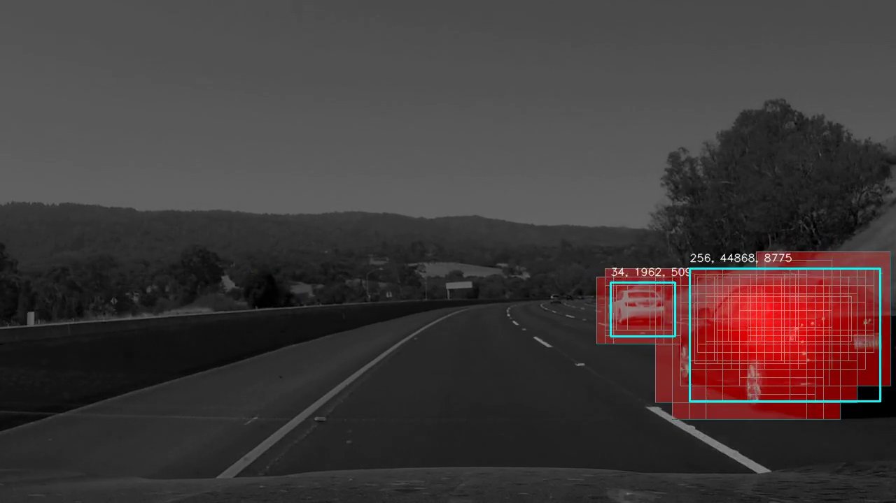

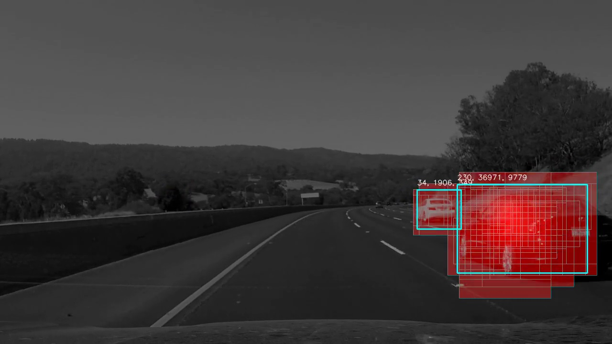

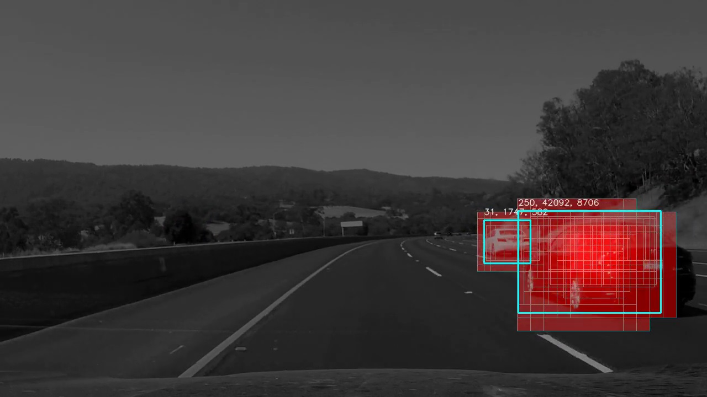

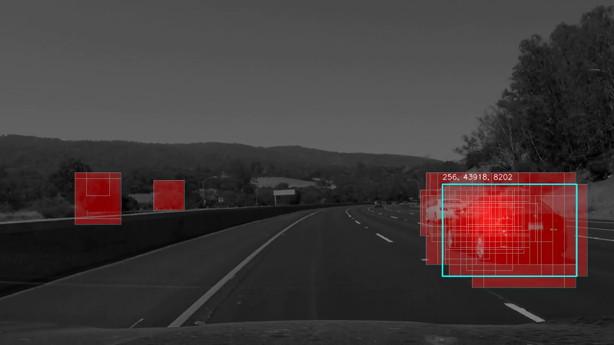

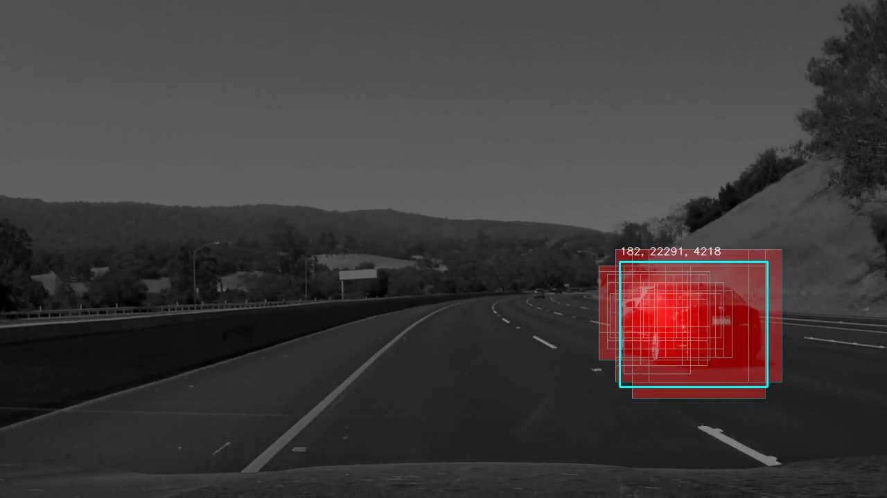

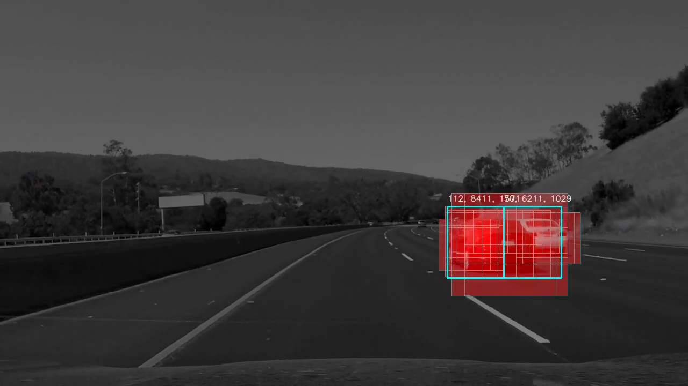

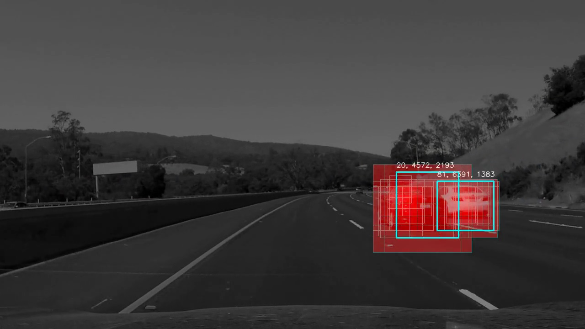

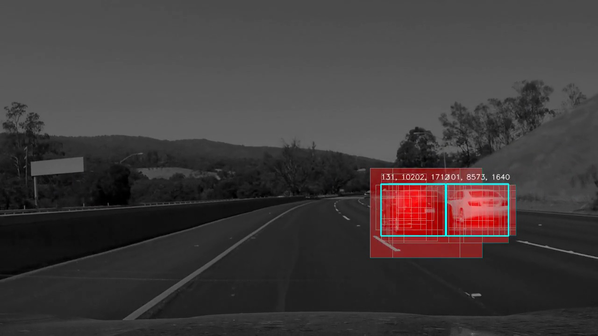

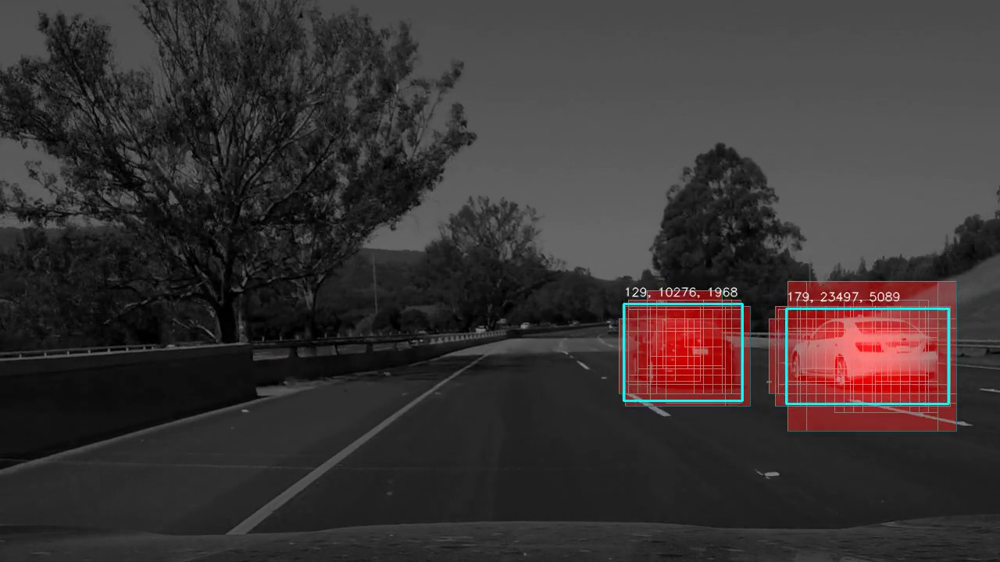

Or you can see whole [test video](./test_videos_output/heat_map/project_video_heat.mp4) with extended heat map annotation.

And [challenge video](./test_videos_output/heat_map/challenge_video_heat.mp4)

And final image looks like this:

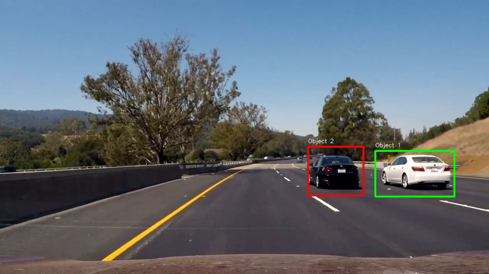

---

### Discussion

#### 1. Briefly discuss any problems / issues you faced in your implementation of this project.  Where will your pipeline likely fail?  What could you do to make it more robust?

* The main issue I faced with during this project is how to find out an optimal parameters to whole system which will work in different real conditions. It's weakness of mathematical approaches in comparison to algorithmic approaches like deep leaning. From one side mathematical approaches are too robust, because we always expect same results with same set of parameter. But from other side set of parameter can never be optimal. Small number of parameter means limited number of freedom degrees. Big number of parameters - too much combinations and not clear how to optimize.
* No methods how to control model teaching. Even in case when SVC kernel trick allows increase number of parameters, no way how to control this teaching process to prevent overfitting. Algorithm receive set of images for training and outcome is always the same (with same parameters). The related problem - increasing number of teaching samples significantly decrease performance due to limited resources of device.
* Classifiers output is binary. No way how to teach it detect level of similarity. Using it in heat maps helps algorithm be more robust. For example if classifier outcome is vehicle with 60% probability on several video frames, it most likely not vehicle at all.
* Significant amount of false positives is caused by objects outside of road. It's natural, because even for human it can be a problem detect object correctly without outside context. So it's necessary not only teach algorithm detect vehicles, but detect scenes where no vehicles at all (or it too small to be interesting detect it). Due to perspective distortion, it most likely parallelograms will be used instead of squares for filtering regions with cars from regions without. This approach can be combined with other methods of space measurements and vehicle positioning with help of GPS and LiDAR for example.
* How to measure distance to object - using perspective transformation allow calculate distance for each object point. But result will be smashed in space much, because vehicle is spatial object. Center of bottom rectangle bound detected around vehicle is good start point for distance calculation. But it's not so accurate and due to perspective distortion error can be significant.
* Related problem - images too far can be hardly detected with this algorithm. For 40 km/h it's probably not so critical. But in real life static object on 30 m distance will appear too close less than in one second. And we must start recognize it when it on 100 m distance if possible to have time and space for maneuver.

### Conclusion
Mathematical methods of classification provides very robust results but not so accurate as necessary. For real implementation I most likely use less accurate but more fast classifiers like Linear SVC for sake of performance. And combine it with deep learning algorithms to increase total accuracy. To limit area for objects searching it's good idea combine it with other technical methods of vehicle positioning on the road and orientation in space.
